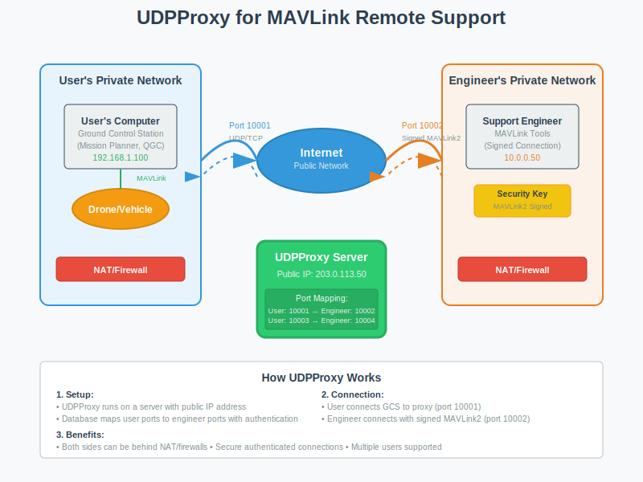

# UDP Proxy for MAVLink

This is a UDP/TCP/WebSocket Proxy for MAVLink to facilitate remote support of ArduPilot users.

For more information on using the support proxy see https://support.ardupilot.org

## Features

- Both support engineer and user can be on private networks
- Supports many users running in parallel
- Uses MAVLink2 signed connections from the support engineer
- Uses normal UDP/TCP forwarding in users GCS
- Supports both TCP and UDP, including mixed connections
- Supports WebSocket and WebSocket+SSL TCP connections for both user
  and support engineer
- supports up to 8 simultaneous connections by support engineer

## How It Works



UDPProxy acts as a bridge between ArduPilot users and support engineers:

1. **User Side**: Connects their Ground Control Station to the proxy server (e.g., port 10001)
2. **Proxy Server**: Routes traffic between user and engineer ports with authentication
3. **Engineer Side**: Connects with MAVLink2 signed authentication (e.g., port 10002)

This allows both parties to be behind NAT/firewalls while maintaining
secure, authenticated connections.

Both sides can optionally use WebSocket+SSL to get a fully encrypted link.

## Building

### Prerequisites

```bash
# Ubuntu/Debian
sudo apt install libtdb-dev python3-tdb python3-venv gcc g++ git libssl-dev

```

### Python Virtual Environment Setup

It's recommended to use a Python virtual environment to install pymavlink:

```bash
# Create a virtual environment
python3 -m venv --system-site-packages venv

# Activate the virtual environment
source venv/bin/activate

# Install pymavlink in the virtual environment
pip install pymavlink
```

### Get the source

```bash
# Clone the repository
git clone https://github.com/ArduPilot/UDPProxy.git
cd UDPProxy
```

### Building UDPProxy

```bash
# Build everything (initializes submodules, generates headers, compiles)
make

# Or see all available options
make help
```

**Note: Remember to activate the virtual environment whenever you need to use pymavlink**

## Configuration and Usage

### Initial Setup

UDPProxy should be run on a machine with a public IP address or through an internet domain. Initialize the database once:

```bash
# Initialize the key database
./keydb.py initialise

# Or with virtual environment
source venv/bin/activate
python3 keydb.py initialise
```

### Adding Users

Add support engineer and user port pairs:

```bash
# Add a user: USER_PORT ENGINEER_PORT NAME PASSPHRASE
./keydb.py add 10001 10002 'Support1' MySecurePassPhrase

# Convention examples:
# Even ports for users, odd for engineers:
./keydb.py add 10004 10005 'Support2' AnotherPassPhrase

# Or use port offsets:
./keydb.py add 11001 21001 'Support3' ThirdPassPhrase
```

### Running the Proxy

```bash
# Start the proxy (runs in foreground)
./udpproxy

# Check if running in another terminal
pgrep udpproxy
```

### Supporting WebSocket + SSL

To support SSL encrypted links for WebSocket connections (both for
user connections and support engineer connections) you will need to
provide a fullchain.pem and privkey.pem file in the directory where
you start udpproxy. These files must be readable by udpproxy. SSL
support has been tested with Let's Encrypt certificates. Note that
when you renew your certificates you will need to update the files in
this directory, or use symlinks to the system certificates.

### Automatic Startup

#### The cron way

For production deployment, you can use cron for automatic startup and restart:

```bash
# Edit crontab
crontab -e

# Add these lines:
*/1 * * * * $HOME/UDPProxy/start_proxy.sh
@reboot $HOME/UDPProxy/start_proxy.sh
```

The `start_proxy.sh` script will:
- Check if udpproxy is already running
- Start it if not running
- Log output to `proxy.log` and cron activity to `cron.log`

### Monitoring

```bash
# Check proxy status
pgrep udpproxy

# View logs
tail -f proxy.log      # Proxy output
tail -f cron.log       # Cron activity

# List current users
./keydb.py list

# Check active connections
netstat -ln | grep ":1000[0-9]"
```

## Docker Usage

UDPProxy can also be run using Docker for easier deployment and management.

### Building the Docker Image

```bash
docker build -f docker/Dockerfile -t ap-udpproxy .
```

### Running with Docker

```bash
# Create a volume for persistent data (keys.tdb and logs)
docker volume create udpproxy-data

# Initialize the database (first time only)
docker run --rm -v udpproxy-data:/app/data -it ap-udpproxy keydb.py initialise

# Add users to the database
docker run --rm -v udpproxy-data:/app/data -it ap-udpproxy keydb.py add 10001 10002 'Support1' MySecurePassPhrase

# Run the UDP proxy as deamon
docker run -d --name ap-udpproxy -v udpproxy-data:/app/data -p 10001-10100:10001-10100 ap-udpproxy
```

Adapt exposed port according to your usage.

### Managing the Database with Docker

The Docker container includes an intelligent entrypoint that automatically handles keydb.py commands:

```bash
# All keydb.py operations work directly:
docker run --rm -v udpproxy-data:/app/data -it ap-udpproxy keydb.py list
docker run --rm -v udpproxy-data:/app/data -it ap-udpproxy keydb.py add PORT1 PORT2 Name PassPhrase
docker run --rm -v udpproxy-data:/app/data -it ap-udpproxy keydb.py remove PORT2
docker run --rm -v udpproxy-data:/app/data -it ap-udpproxy keydb.py setname PORT2 NewName
docker run --rm -v udpproxy-data:/app/data -it ap-udpproxy keydb.py setpass PORT2 NewPassPhrase
```

### Viewing Logs and Monitoring

When running UDPProxy in Docker, you can monitor logs and status using these commands:

```bash
# View real-time logs from the running container
docker logs -f ap-udpproxy

# View last 100 lines of logs
docker logs --tail 100 ap-udpproxy

# View logs with timestamps
docker logs -t ap-udpproxy

# Check container status
docker ps | grep ap-udpproxy

# Check container resource usage
docker stats ap-udpproxy

# Access container shell for debugging
docker exec -it ap-udpproxy bash

# View logs inside the container (if available)
docker exec ap-udpproxy tail -f /app/data/proxy.log
```

## Database Management

### keydb.py Commands

The `keydb.py` script provides comprehensive database management:

```bash
# Initialize database (first time only)
./keydb.py initialise

# List all users and their status
./keydb.py list

# Add new user
./keydb.py add PORT1 PORT2 Name PassPhrase

# Remove user
./keydb.py remove PORT2

# Modify existing users
./keydb.py setname PORT2 NewName           # Change name
./keydb.py setpass PORT2 NewPassPhrase     # Change passphrase
./keydb.py setport1 PORT2 NewPORT1         # Change user port

# Examples:
./keydb.py add 10006 10007 'Engineering' SecurePass123
./keydb.py setname 10007 'QA Team'
./keydb.py remove 10007
```

### Database Notes

- **Automatic Port Listening**: When users are added, udpproxy automatically starts listening on new ports without restart
- **Port Conflicts**: The system prevents duplicate port assignments
- **Persistent Storage**: Database is stored in `keys.tdb` file
- **Backup**: Regularly backup the `keys.tdb` file for disaster recovery

### Security Considerations

- **Passphrase Strength**: Use strong, unique passphrases for each user
- **Port Range**: Consider using non-standard port ranges to avoid conflicts
- **Firewall**: Configure firewall rules to allow only necessary ports
- **Access Control**: Limit access to the server and keydb.py script

## Troubleshooting

### Common Issues

**Build Errors:**
```bash
# Missing dependencies
sudo apt install libtdb-dev python3-tdb build-essential git libssl-dev

# Submodule issues
git submodule update --init --recursive --force

# Clean rebuild
make distclean && make
```

**Runtime Issues:**
```bash
# Check if ports are in use
netstat -ln | grep ":10001"

# Check database
./keydb.py list

# Restart proxy
pkill udpproxy && ./udpproxy

# Check logs
tail -f proxy.log
```

**Permission Issues:**
```bash
# Make scripts executable
chmod +x keydb.py start_proxy.sh

# Check database permissions
ls -la keys.tdb
```

### Debug Mode

```bash
# Check system logs
journalctl -f | grep udpproxy
```

## Testing

### Automated CI Testing

UDPProxy includes comprehensive CI testing to validate UDP and TCP connection functionality:

```bash
# Run all tests locally
./run_tests.sh

# Run specific test suites
source venv/bin/activate
pytest tests/test_connections.py -v
pytest tests/test_authentication.py -v
```

## Contributing

1. **Code Style**: Follow existing C++ and Python conventions
2. **Testing**: Run the test suite before submitting changes
3. **Documentation**: Update README for new features
4. **Compatibility**: Ensure changes work with existing databases

## License

UDPProxy is licensed under the GNU General Public License version 3 or later.

See `COPYING.txt` for full license terms.
